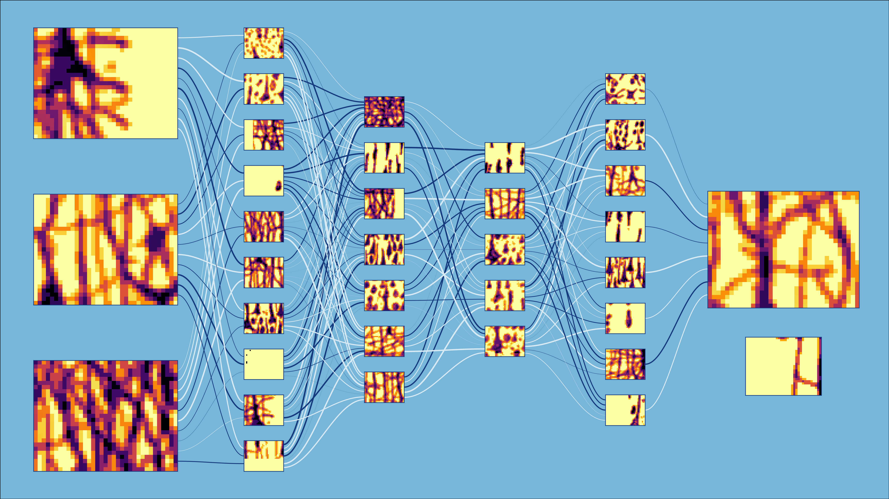

# AnnViz: Autoencoder Nueral Network Visualizer

AnnViz is a python package to visualize custom autoencoder nueral networks. As is, this is just a workable framework. I am in the process of finishing the project.

Autoencoders are a type of neural network architecture that are used for unsupervised learning. They are designed to learn a compact representation of the input data and then reconstruct the original input from this compact representation. This makes autoencoders particularly useful for tasks such as dimensionality reduction and anomaly detection. Other neural network architectures include feedforward networks, recurrent networks, convolutional networks, etc.

## Dependencies
AnnViz was written with `Python 3.9`, but is a realtively simple package that leverages matplotlib's simplest functions. It should run fine on most any version of Python.

Additional python packages required:
- matplotlib
- numpy
- PIL

## Additional Resources
- See [API](doc/api.md) for a general overview of annViz API
- See [Style Guide](https://github.com/andrewp2010/styleGuide/blob/main/styleGuide.md) for the style guide referenced for this project

## License
Apache License 2.0