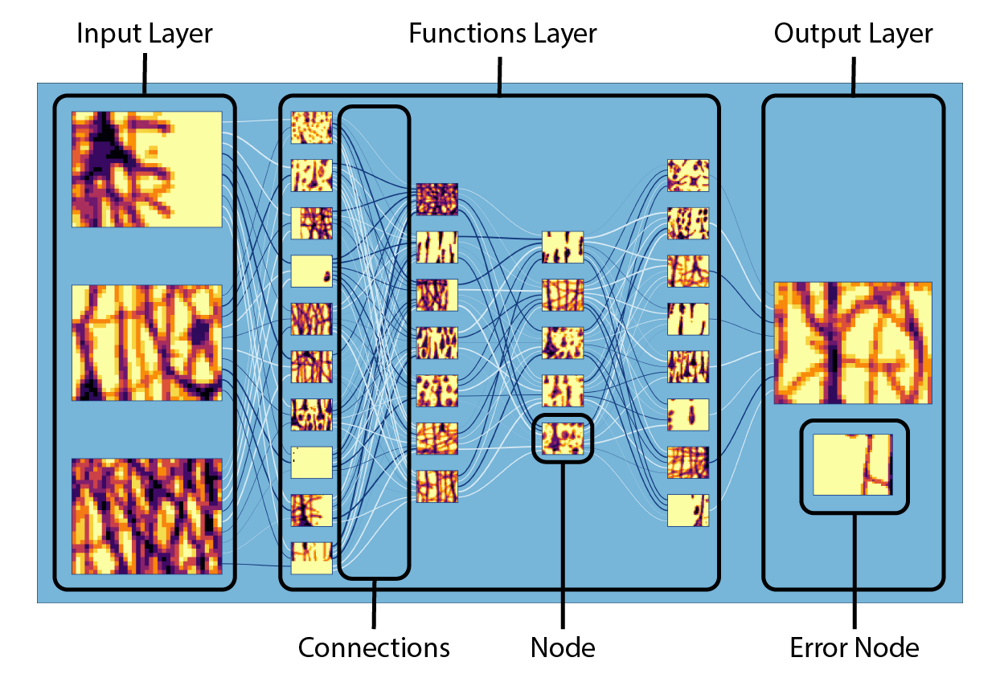

## API

`main.py` is an example script that will run out of the box. Additionally, a number of the package's functions have default parameters. Make note of what parameters are required during use.

`Visualizer(width, height, margin, nodeAspectRatio, gapScale, ioLayerScale)`:
- Creates/intitializes visualizer object and image dimensions
	- width (float, def: 16): inch length of final image width
	- height (float, def: 9): inch length of final image height
	- margin (float, def: 0.5): inch length of final image margin
	- nodeAspectRatio (float, def: 1.33): aspect ratio of all nodes
	- gapScale (float, def: 0.5): scale of gap between vertical nodes, relative to the node size in that layer
	- ioLayerScale (float, def: 0.175): scale of input/output layers, relative to the final image size

`setColor(lgtColor, midColor, drkColor)`:
- Customize the colors the final layout will use
	- lgtColor (string): hex color code for the light valued color
	- midColor (string): hex color code for the mid valued color
	- drkColor (string): hex color code for the dark valued color

`loadTempImage(filename)`:
- Loads image file that will be used to create temp images for the nodes in teh network
	- filename (string): name for desired file

`createInputLayer(numNodes)`:
- Creates input layer
	- numNodes (int): the number of input nodes

`createFunctionLayer(pattern)`:
- Creates any number of function layers, relative to the length of `pattern`
	- pattern (int array): used to describe how many layers and nodes to create
		- example: `pattern = [10, 7, 5, 8]` creates four layers with 10, 7 , 5, and 8 nodes respectively
	
`createOutputLayer(errorNode, errorNodeScale)`:
- Creates an output layer, with the option of including a custom error node
	- errorNode (bool, def: True): whether to create a custom error node
	- errorNodeScale (float, def: 0.5): scale of custom error node, relative to the single output node

`createLayerNodeConnections()`:
- Plots connections between nodes

`exportImage(filename, usrDpi)`:
- Export final image
	- filename (string): filename to export final image file to
	- usrDpi (int, def: 300): desired final image DPI